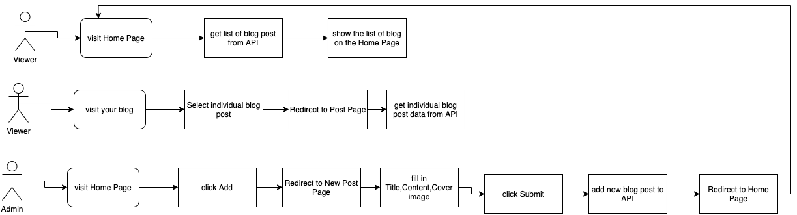

#Create a project from scratch
##Listes des besoins pour le projet
1. lister le user stories
2. faire un user workflow pour comprendre ses besoins ( en
 utilisant draw.io)
  
3. lister les besoins (nombres de pages, contenus de chaque page)
4. les besoins techniques pour réaliser le projet ( langage
  niveau front et back, les librairies, les frameworks, etc.)
##Créer un wireframe du projet
un wireframe sera un dessin en block pour voir comment notre
 projet sera structurer ( à quoi ressemblera les pages)

 